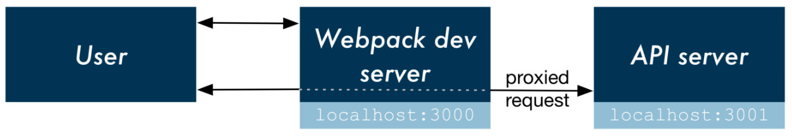

# 基于WEB3D的青海非物质文化遗产保护平台设计与实现（数据库与服务器部分）


## 目录

- [概述](#概述)
  - [整体架构](#整体架构)
  - [环境配置](#环境配置)
  - [启动网站](#启动网站)
- [非遗数据库](#非遗数据库)
- [服务器端](#服务器端)
  - [Restful API](#restful-api)
  - [前端获取数据](#前端获取数据)
- [脚本说明](#脚本说明)
  - [scripts/convert\_video\_codecs.js](#scriptsconvert_video_codecs.js)
  - [scripts/generate\_video\_thumbnails.js](#scriptsgenerate_video_thumbnails.js)
  - [scripts/init.mongo.js](#scriptsinit.mongo.js)
  - [使用场景：增加一个非物质文化遗产项](#使用场景增加一个非物质文化遗产项)
- [关于（迁移）唐卡博物馆网站的环境配置](#关于唐卡博物馆网站的环境配置)
  - [唐卡博物馆网站概述](#唐卡博物馆网站概述)
  - [MySQL配置](#mysql配置)
  - [主网站（web3dtest）](#主网站（web3dtest）)
  - [静态文件服务器（apache-tomcat）](#静态文件服务器（apache-tomcat）)
  - [算法后台（http\_test）](#算法后台（http_test）)


## 概述

### 整体架构

网站前端基于[React](https://github.com/facebook/react)，通过[create-react-app脚手架](https://github.com/facebook/create-react-app)快速搭建，其中内置了一个静态文件服务器；为了连接数据库及提供动态网页内容，基于[Nodejs]()建立了一个后台API服务器，具体内容可见[服务器端](#服务器端)

代码结构如下：

- `src/` 前端react-js和css代码
- `server/` [后台API服务器](#服务器端)
- `json_db/` [资源库json文件](#非遗数据库)
- `scripts/` [资源库预处理脚本](#脚本说明)
- `public/` 静态文件（包括html、图片、视频、3D模型文件等）


### 环境配置

1. 安装[Mongodb]()数据库，参考[]()
2. 安装[Node]()和[npm]()的最新版本，参考[]()
3. 运行以下命令安装依赖包，依赖包在`package.json`中指定
   ```
   npm install
   ```

**Note: `scripts/`中的脚本依赖第三方程序，参考[脚本说明](#脚本说明)章节。**

### 启动网站

运行以下命令启动网站

```bash
npm run start
```

**Note: 启动网站前，确保Mongo Server已经启动且插入了数据，在已部署的台式机上，Mongo Server已经启动，数据目录设置在`~/data/db`。启动Mongo Server的命令为`mongod --dbpath /your/path/for/datafiles/`，关于如何初始化数据库中的数据，参考[scripts/init.mongo.js](#scriptsinit.mongo.js) **


## 非遗数据库

数据库中包括了共83个项目，覆盖传统医药、曲艺、民间文学、民间音乐、传统戏剧、杂技与竞技、民间美术、传统手工艺、民俗、民间舞蹈十个大类

每一个项目内容格式化描述为一个JSON字典中，用于渲染网站的Detail页面，各字段意义描述如下：

- `title` 项目标题，会用在Detail页面的URL中，要求唯一
- `category` 一级大类名称
- `location` 经纬度
- `thumbnail` 该项目的封面图路径
- `keywords` 关键字，用于检索
- `gallery` 该项目所有的图片、视频的路径
- `contents` 文字、图片描述

详情可参考`json_db`中已经写好的JSON文档。


## 服务器端

由[create-react-app](https://github.com/facebook/create-react-app)建立起的[React](https://github.com/facebook/react)开发框架自带了一个静态文件服务器（webpack-dev-server），随着`react-scripts start` 命令启动，运行在默认的3000端口。为了能够动态获取数据，需要建立一个API后端服务，为前端动态提供数据。



通过如下配置`package.json`，访问`/api/*`的url将定向至运行在3001端口的API代理服务器。

```json
  "proxy": {
    "/api/*": {
      "target": "http://localhost:3001/"
    }
  }
```

参考[create-react-app README](https://github.com/facebook/create-react-app/blob/master/packages/react-scripts/template/README.md#proxying-api-requests-in-development) 和 [using-create-react-app-with-a-server](https://www.fullstackreact.com/articles/using-create-react-app-with-a-server/)

### Restful API

该API服务器基于[Nodejs](https://nodejs.org/zh-cn/)，代码位于 `/server/server.js`，在整个网站设计中，其向下连接数据库，向上为前端提供Restful-API。共提供一下几个API：

- `/api/items` 返回所有item的列表
- `/api/catalogs`  返回所有catalogs的列表
- `/api/configs`  返回config的字典
- `/api/items/:title` 返回指定title的item，用于`Detail`页面
- `/api/catalog_groups` 返回按照category分组的item的title和thumbnail信息，用于`Catalog`页面
- `/api/locations` 返回item的地理位置信息，用于`Location`页面
- `/api/textsearch/:keyword` 返回按照指定keyword检索的item，用于`SearchResults`页面
- `/api/images?page=&perPage=` 返回所有图片的地址，按照给定参数分页，用于`Discovery`瀑布流页面。

### 前端获取数据

在前端js文件中往往有一个`loadData()`函数，会在恰当的时机使用`fetch()`方法异步调用上述代理服务器提供的API，使用`Promise`控制流程。

参考[create-react-app README]( https://github.com/facebook/create-react-app/blob/master/packages/react-scripts/template/README.md#fetching-data-with-ajax-requests)


## 脚本说明

### scripts/convert\_video\_codecs.js

#### 功能

将/public/img/中浏览器不支持的视频文件转码，满足以下条件之一的视频文件将被转码并替换：

* 扩展名不是mp4
* 视频编码不是H264
* 音频编码不是AAC
* 视频高度高于设定阈值（代码中设置为1080px）

#### 代码流程

1. 找到`/public/img/*/*/`下的所有`mp4/flv/mts`文件
2. 分析其编码等信息
3. 跳过无需转码的视频文件，对需要转码的视频文件进行转码
4. 转码中的文件会保存到`.tmp`的中间文件中。多个文件的转码是并行的，每完成10%会打印出进度信息
5. 转码完成后，原视频文件会被删除，生成的`.tmp`文件被重命名为原视频文件名

#### 注意事项

这个脚本需要依赖[ffprobe](https://ffmpeg.org/ffprobe.html)、[handbrake](https://handbrake.fr/)两个外部可执行程序，可如下安装:

- Linux(Ubuntu)：

  ```sh
  sudo apt install ffmpeg
  sudo apt install handbrake-cli
  ```

- Windows: 

1. Download ffprobe binary, declare its location in `.env`，
   e.g. write the following line in `.env`
   ```
   FFPROBE_BINARY="d:/Softwares/ffmpeg-20180723/bin/ffprobe.exe"
   ```
2. Download handbrake binary, place the binary under `node_modules/handbrake-js/.bin/`

#### 运行脚本

```sh
node scripts/convert_video_codecs.js
```


### 2. scripts/generate\_video\_thumbnails.js

#### 功能

生成`public/img/`中MP4视频文件的缩略图（默认为640x480大小），命名格式为：视频文件名+.thumbnail.jpg

#### 注意事项

该生成的缩略图用在Detail页面的图片Gallery中
代码中仅生成了MP4视频格式的缩略图，使用前请保证视频均已转码成MP4格式

#### 运行脚本

```sh
node scripts/generate_video_thumbnails.js
```


### 3. scripts/init.mongo.js

#### 功能

根据json文件，初始化数据库。在名为`qinghai_heritage`的DB中共生成三个collection：
1. items：其中的每个Document对应一个非遗JSON文件（`json_db/*/*.json`）， 对应网站中的一个Detail页面内容。
2. catalogs：指定首页上的十个类别和其对应的封面图路径。
3. configs：指定首页上的轮播图路径等。
数据库初始化中的各项操作均为异步，代码中使用`Promise`规范的`then`方法控制数据库操作流程。


#### 注意事项

1. 由于数据量很小，为了方便操作，允许每次增加或更改了json文件都重新初始化所有的数据库。
2. 可以使用[Native Mongo Shell](https://docs.mongodb.com/manual/mongo/)操作数据，也可以使用可视化的GUI（如[Mongo Compass](https://www.mongodb.com/products/compass)，已在台式机上安装）

#### 运行脚本

```sh
node scripts/init.mongo.js
```

### 4. 使用场景：增加一个非物质文化遗产项

1. 按照设计的json模板，写好该项的json文件，放置在`json_db`下相应的文件夹中
2. 将json文件中相关的图片和视频放置在指定的路径下
3. 运行`scripts/convert_video_codecs.js`，若新增加的视频需要转码，则会执行转码并覆盖原文件；已转码过的视频不会再进行转码。
4. 运行`scripts/generate_video_thumbnails.js`，生成视频缩略图；已生成过的缩略图不会再重新生成。
5. 运行`scripts/init.mongo.js`，初始化所有的数据库。也可用其他方式更改数据库。


## 关于唐卡博物馆网站的环境配置

### 唐卡博物馆网站概述
唐卡博物馆网站分成了以下三个工程项目，均放置在`~/Programs/`

- 主网站（web3dtest）为[Grails](https://grails.github.io/grails2-doc/2.5.0/guide/single.html#downloadingAndInstalling)项目
- 静态文件服务器（apache-tomcat）
- 算法后台（http_test），提供唐卡检索、草图绘制的后台支持

另外需要[`MySQL`](https://www.oracle.com/technetwork/database/mysql/index.html)数据库支持


### MySQL配置

安装`MySQL`的server和client，在此过程中设置root密码为`123456`

```
sudo apt install mysql-server mysql-client
```

在bash中连接`MySQL` Server，创建一个名为`feiyi_DB`的数据库，并加载`~/Programs/feiyi_db.sql`中的数据

```
mysql -u root -p
CREATE DATABASE feiyi_DB;
USE feiyi_DB;
SOURCE feiyi_db.sql
```

### 主网站（web3dtest）

#### 配置运行环境：

1. 下载java（解压于 `~/Java/jdk1.8.0_181`）
2. 根据其使用的版本下载Grails（解压于 `~/Downloads/grails-2.5.0`）
3. 设置环境变量，在`~/.bashrc`中添加如下
   ```bash
   export JAVA_HOME=/home/vrlab/Java/jdk1.8.0_181
   export JRE_HOME=$JAVA_HOME/jre
   export CLASSPATH=.:$JAVA_HOME/lib:$JAVA_HOME/jre/lib:$CLASSPATH
   export GRAILS_HOME=/home/vrlab/Downloads/grails-2.5.0
   export PATH=$JAVA_HOME/bin:$JAVA_HOME/jre/bin:$GRAILS_HOME/bin:$PATH
   ```
4. ```source ~/.bashrc```

#### 在项目根目录执行启动脚本

```bash
grails run-app
```

### 静态文件服务器（apache-tomcat）

#### 配置运行环境
1. Java
2. 设置环境变量，在`~/.bashrc`中添加如下
   ```bash
   export CATALINA_BASE=/home/vrlab/Programs/apache-tomcat-7.0.82
   export CATALINA_HOME=/home/vrlab/Programs/apache-tomcat-7.0.82
   ```
3. ```source ~/.bashrc```

#### 启动脚本

```bash
cd apache-tomcat-7.0.82/bin
./startup.sh
```
可能需要为某些脚本文件添加可执行权限```chmod +x ./bin/*.sh```

### 算法后台（http_test）

#### 配置Python运行环境

1. 安装`conda`
2. 创建`conda`环境`tangkaR`
   ```bash
   conda create -n tangkaR python=3.5
   ```
3. 安装python包
   - django=1.11
   - mysqlclient=1.3
   - numpy
   - tensorflow=1.4
   - opencv

#### 启动脚本

```
source activate tangkaR
python manage.py runserver 8000
```
或者
```
./startup.sh
```
